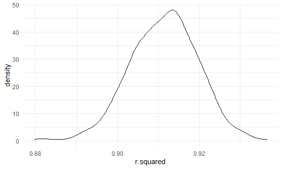

p8105_hw6_sm4956
================
Shivangi Deepak Mewada

## Problem 0

-   created repository and R project for HW6, created rmd file and
    rending to GitHub.
-   created a sub-directory/ data folder for the data set files to be
    used for this HW

``` r
library(tidyverse)
library(readxl)
library(dplyr)
library(ggridges)
library(tibble)
library(broom)
library(purrr)
library(modelr)
library(mgcv)
options(tibble.print_min = 5)

knitr::opts_chunk$set(
  fig.width = 6,
  fig.asp = .6,
  out.width = "90%"
)

theme_set(theme_minimal() + theme(legend.position = "bottom"))

options(
  ggplot2.continuous.colour = "viridis",
  ggplot2.continuous.fill = "viridis"
)

scale_colour_discrete = scale_colour_viridis_d
scale_fill_discrete = scale_fill_viridis_d
```

### Problem 1

Obtaining the dataset for 2017 Central Park Weather data and cleaning
it.

``` r
weather_df = 
  rnoaa::meteo_pull_monitors(
    c("USW00094728"),
    var = c("PRCP", "TMIN", "TMAX"), 
    date_min = "2017-01-01",
    date_max = "2017-12-31") %>%
  mutate(
    name = recode(id, USW00094728 = "CentralPark_NY"),
    tmin = tmin / 10,
    tmax = tmax / 10) %>%
  select(name, id, everything())
```

To obtain a distribution for $\hat{r}^2$: drawing bootstrap samples,
extracting the values and summarizing. Using `modelr::bootstrap` to draw
the samples and `broom::glance` to produce `r.squared` values. Creating
plot for estimate distribution.

``` r
weather_df %>% 
  modelr::bootstrap(n = 1000) %>% 
  mutate(
    models = map(strap, ~lm(tmax ~ tmin, data = .x) ),
    results = map(models, broom::glance)) %>% 
  select(-strap, -models) %>% 
  unnest(results) %>% 
  ggplot(aes(x = r.squared)) + geom_density()
```



In this example, the $\hat{r}^2$ value is high, and the upper bound at 1
may be a cause for the generally skewed shape of the distribution. If we
wanted to construct a confidence interval for $R^2$, we could take the
2.5% and 97.5% quantiles of the estimates across bootstrap samples.
However, because the shape isn’t symmetric, using the mean +/- 1.96
times the standard error probably wouldn’t work well.

a distribution for $\log(\beta_0 * \beta1)$ can be done using a similar
approach, with a bit more wrangling before making the plot.

``` r
weather_df %>% 
  modelr::bootstrap(n = 1000) %>% 
  mutate(
    models = map(strap, ~lm(tmax ~ tmin, data = .x) ),
    results = map(models, broom::tidy)) %>% 
  select(-strap, -models) %>% 
  unnest(results) %>% 
  select(id = `.id`, term, estimate) %>% 
  pivot_wider(
    names_from = term, 
    values_from = estimate) %>% 
  rename(beta0 = `(Intercept)`, beta1 = tmin) %>% 
  mutate(log_b0b1 = log(beta0 * beta1)) %>% 
  ggplot(aes(x = log_b0b1)) + geom_density()
```


## Problem 2

creating dataset for homicides. Data wrangling for: creating a new
variable with city_state, creating binary variable for solved based on
disposition, removing un-required states, keeping only White and Black
races, converting victim_age to numeric form.

``` r
homicide_ds = read_csv(
    "data/homicide-data.csv") %>%
  janitor::clean_names() %>%
  unite('city_state',"city":"state", remove = FALSE)%>%
  select(-city,-state)%>%
  mutate (solved = case_when (disposition == "Closed without arrest" ~ "Unresolved", 
                              disposition == "Open/No arrest" ~ "Unresolved", 
                              disposition == "Closed by arrest" ~ "Resolved" ),
          solved = as.factor (solved),
          solved = fct_relevel(solved, "Unresolved"),
          victim_age = as.numeric(victim_age)) %>%
  filter (!(city_state %in% c("Tulsa_AL","Dallas_TX", "Phoenix_AZ", "Kansas City_MO"))) %>%
  filter (!(victim_race %in% c("Asian", "Hispanic","Other", "Unknown"))) 
```

Filtering for Baltimore city, using the glm function to fit a logistic
regression with resolved vs unresolved as the outcome and victim age,
sex and race as predictors. Applying broom::tidy to obtain estimate and
confidence intervals for adjusted OR. Data wrangling for adj OR and 95%
CI for the OR.

``` r
baltimore_homi = homicide_ds %>%
  filter(city_state == "Baltimore_MD")

  baltimore_log = baltimore_homi %>%
  glm(solved ~ victim_age + victim_race + victim_sex, data = ., family = binomial()) %>%
  broom::tidy() %>%
  mutate (adj_OR = exp(estimate),
          lower_95ci = exp(estimate - (1.96 * std.error)),
         upper_95ci = exp(estimate + (1.96 * std.error))) %>%
    filter (term == "victim_sexMale") %>%
    select (adj_OR, lower_95ci, upper_95ci)
  
    knitr::kable((baltimore_log), digits = 3)
```

| adj_OR | lower_95ci | upper_95ci |
|-------:|-----------:|-----------:|
|  0.426 |      0.325 |      0.558 |

-   In Baltimore, the odds of solving homicides comparing male victims
    to female victims are **0.426 (95% CI: 0.325,0.558)**, adjusting for
    age and race.

Applying glm for all the cities, and extracting the adjusted odds ratio
(and CI) for solving homicides comparing male victims to female victims.
Using purrr::map and unnest to create a dataframe ‘cities_log’ with
estimated ORs and 95% CIs for each city.

``` r
cities_log = homicide_ds %>%
  group_by (city_state) %>%
  nest () %>%
  mutate(model_cities = map(.x = data, ~ glm(solved ~ victim_age + victim_race + victim_sex, data = ., family = binomial())),
         model_cities = map(model_cities, broom::tidy)) %>%
  unnest(model_cities) %>%
  mutate (adj_OR = exp(estimate),
          lower_95ci = exp(estimate - (1.96 * std.error)),
         upper_95ci = exp(estimate + (1.96 * std.error))) %>%
  filter (term == "victim_sexMale") %>%
  select (city_state, adj_OR, lower_95ci, upper_95ci) %>%
  ungroup()
```

Plotting the ORs and 95% CI for all cities, arranging in order according
to the estimated ORs.

``` r
plot_cities_model = cities_log %>%
  mutate (city_state = reorder (city_state, adj_OR)) %>%
  ggplot(aes (y = city_state, x = adj_OR)) + 
  geom_point() + 
  geom_errorbar(aes(xmin = lower_95ci, xmax = upper_95ci)) + 
  theme(legend.position = "bottom", axis.text.x = element_text( hjust = 1)) + 
  labs (title = "Plot for OR estimates across cities and states",
        x = "ORs with 95% CI",
        y = "City and State")
  
plot_cities_model
```


By eyeballing the plot, it can be seen that **most of the cities have OR
less than 1**. Cities like **Atlanta, Richmond, Nashville, Fresno,
Stockton and Albuquerque have OR \>= 1**. It means that the odds of
solving homicide among male victims in most of the cities except for the
ones stated above are less than those of solving homicides among female
victims, adjusting for age and race. The **95% confidence intervals for
about half of the cities seem to include 1**, suggesting they are **not
statistically significant**.
